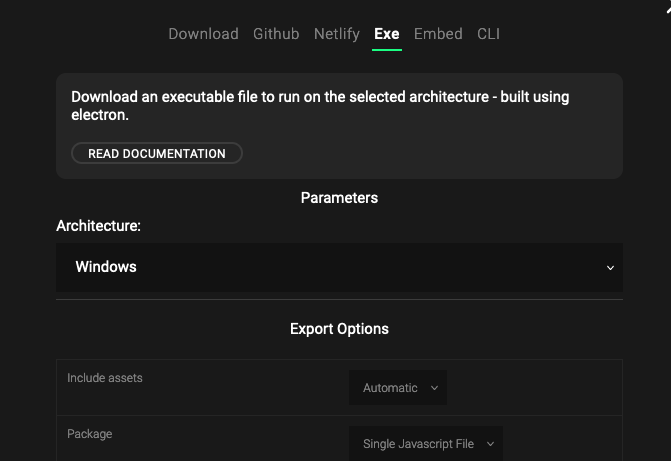

# Export creating a standalone executable

Select the "EXE" option in the export dialog:

This export option allows you to create a standalone executable that will run on windows, linux and mac
natively.

We are using [electron](https://www.electronjs.org/) for the cross-platform running of cables patches and
we will build the executables using server-resources given to us by you in using [github actions](https://github.com/features/actions).

The executable will be build and downloadable on github after all is done (see CAVEATS)

# Prerequisites

- an account on [github](https://github.com/)
- DO NOT create an empty repository
- an [access token](https://github.com/settings/tokens) for your github-user with at least "repo" permissions
- check that [github actions](https://github.com/features/actions) is enables in the repositories settings on github

# Parameters

All these parameters can only be changed/entered by the owner of the patch. Exports can be done to configured deployments
by all collaborators added to the patch.

## Repository Owner

Put in the name of the repository owner, most of the time this is your github username.

If your repository URL is `https://github.com/cables-gl/cables-cli/` your ownername will be `cables-gl`

## Repository Name

Put in the name of the repository. DO NOT PUT IN AN EXISTING repository. cables will create a new repository for you.

## Branch

This can be left blank or pick any branch you want the changes to be pushed to. ONLY pushes to `main` will trigger
building the executables!

## Access Token

Enter your generated [access token](https://github.com/settings/tokens) that has at least "repo" permissions in github.

# WALKTHOUGH
- enter the above information
- click on button
- wait for the two buttons to appear
- click on "View progress" to see the progress of your build on github
- click on "View finished builds" to jump to the download page on github (it might take a few minutes for build to show up here)

# CAVEATS
- IGNORE THE FIRST BUILD! this is mainly to create the "framework", there will be a second run that then builds your actual patch.
- this will fail if the repository given already exists before the first run
- any subsequent run will update (and replace) the current patch
- old versions will still be available for download on the release page of your repository

## github pages

# Export Options

You can choose how the contents of your export should look, the defaults should be fine for almost everything.

## Include assets

If your patch uses uploaded files (textures, audio, data, ...) choose one of the following options to have
these files included in the export.

- Automatic: Tries to guess which files are used in the patch and includes only used assets.
- All: Includes all the assets uploaded to the patch or referenced in there, this is the safe option.
- None: Does not include any assets in the export, smaller download but some things might not work in the export

## Package

- Single Javascript File: packages and minifies everything into one single javascript file to include
- Multiple Files: will keep the patch configuration, your code, and core code in seperate files

## Compatibility

- Modern browsers: does nothing to make sure your patch runs in every browser
- Old browsers: uses [babel](https://babeljs.io/) to try make your patch run on older browsers, in general should not be needed anymore