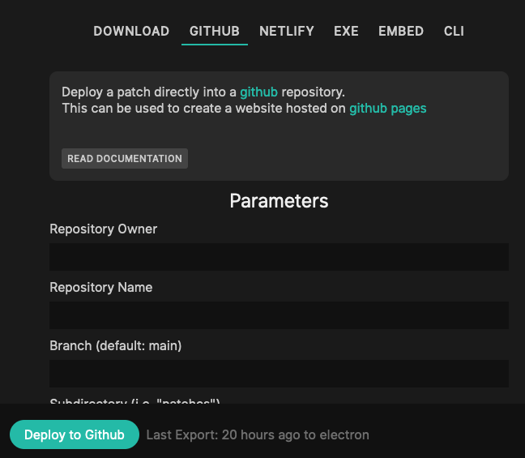

# Export to github (pages)

Select the "GITHUB" option in the export dialog:

## Prerequisites

- an account on [github](https://github.com/)
- any repository, create one [here](https://github.com/new) if needed
- an [access token](https://github.com/settings/tokens) for your github-user with at least "repo" permissions
- (if wanted) activate [github pages](https://pages.github.com/) for your repository in the repositories settings on github
  - your repository needs to be made public for this to be free
  - you need to pick a branch when activating pages, remember this for the settings below    
    
## Parameters

All these parameters can only be changed/entered by the owner of the patch. Exports can be done to configured deployments
by all collaborators added to the patch.

### Repository Owner

Put in the name of the repository owner, most of the time this is your github username. 

If your repository URL is `https://github.com/cables-gl/cables-cli/` your ownername will be `cables-gl`

### Repository Name

Put in the name of the repository, if your repository URL is `https://github.com/cables-gl/cables-cli/` 
the name of the repository will be `cables-cli`

### Branch

This can be left blank, set to `master` for older repositories or pick any branch you want the changes to be pushed to.

### Subdirectory

If you want your patches to reside in a subdirectory of your repository, put the name of that directory here.
This is a good way to have multiple patches in the same repository but in different directories (`patch1/`, `patch2/`, ...)

### Access Token

Enter your generated [access token](https://github.com/settings/tokens) that has at least "repo" permissions in github.

## WALKTHOUGH
- enter the above information
- click on button
- wait for the two buttons to appear
- click on "View Deployment" to visit your website on github
- click on "Deploments overview" to see your repository on github

## CAVEATS
- this will not work if there are any merge conflicts, do not change any cables files from outside cables
- this will overwrite any patch that has been exported to the same repo/subdir-combination before
- use git commit history to roll-back any mishaps

## Export Options

You can choose how the contents of your export should look, the defaults should be fine for almost everything.

### Include assets

If your patch uses uploaded files (textures, audio, data, ...) choose one of the following options to have
these files included in the export.

- Automatic: Tries to guess which files are used in the patch and includes only used assets.
- All: Includes all the assets uploaded to the patch or referenced in there, this is the safe option.
- None: Does not include any assets in the export, smaller download but some things might not work in the export

### Package

- Single Javascript File: packages and minifies everything into one single javascript file to include
- Multiple Files: will keep the patch configuration, your code, and core code in seperate files

### Compatibility

- Modern browsers: does nothing to make sure your patch runs in every browser
- Old browsers: uses [babel](https://babeljs.io/) to try make your patch run on older browsers, in general should not be needed anymore