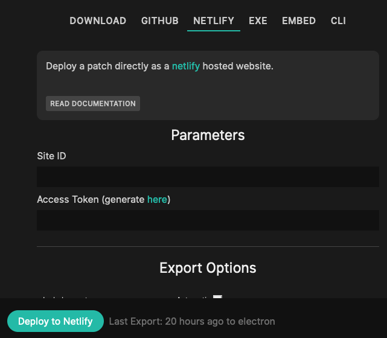

# Export and deploy to netlify

Select the "NETLIFY" option in the export dialog:

This option will allow you to deploy your patch to [netlify](https://www.netlify.com/), a free (for smaller projects)
hosting service that even allows for own domains and HTTPs management.

## Prerequisites

- an account on [netlify](https://www.netlify.com/)
- an [access token](https://app.netlify.com/user/applications) for your netlify-user

## Parameters

All these parameters can only be changed/entered by the owner of the patch. Exports can be done to configured deployments
by all collaborators added to the patch.

### Side ID

Enter your Side ID in netflify, you will find it after creating a new site, check that sites setting (General -> Site details)
and then copy the "API ID" to the textfield in the export dialog in cables.

### Access Token

Create an [access token](https://app.netlify.com/user/applications) and copy it into the textfield.

## Video Tutorial
<iframe width="560" height="315" src="https://www.youtube.com/embed/L5BGMs7vKuI" title="Netlify Export - Byte Size" frameborder="0" allow="accelerometer; autoplay; clipboard-write; encrypted-media; gyroscope; picture-in-picture" allowfullscreen></iframe>

## WALKTHOUGH
- enter the above information
- click on button
- wait for the two buttons to appear
- click on "View Deployment" to visit your website on netlify
- click on "Deploments overview" to see your former deployments to this site on netlify

## CAVEATS
- your site can only host one cables patch, it will also overwrite everything that was on that site before
- you can use the deploy-history of netlify to roll-back any mishaps

## Export Options

You can choose how the contents of your export should look, the defaults should be fine for almost everything.

### Include assets

If your patch uses uploaded files (textures, audio, data, ...) choose one of the following options to have
these files included in the export.

**Use "All" if you are generating filenames on the fly (iterators, arrays, ...) to make sure all files are available in the Export**

- Automatic: Tries to guess which files are used in the patch and includes only used assets.
- All: Includes all the assets uploaded to the patch or referenced in there, this is the safe option.
- None: Does not include any assets in the export, smaller download but some things might not work in the export

### Package

- Single Javascript File: packages and minifies everything into one single javascript file to include
- Multiple Files: will keep the patch configuration, your code, and core code in seperate files

### Compatibility

- Modern browsers: exports your patch as is
- Old browsers: uses [babel](https://babeljs.io/) to try make your patch run on older browsers, in general should not be needed anymore
