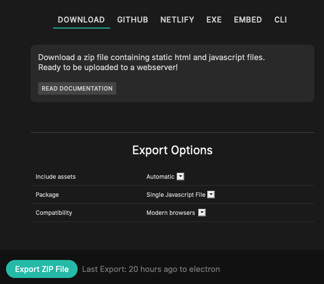

# Export a ZIP file

Select the "DOWNLOAD" option in the export dialog:

If you just want to download your patch and put it on any webserver that you can upload files to, this
is your best option. 

The resulting zip-file will include an example index.html to make integration easier, putting all of this
on a webserver should give you a running patch in no time.

## Video Tutorial

## Export Options

You can choose how the contents of your export should look, the defaults should be fine for almost everything.

### Include assets

If your patch uses uploaded files (textures, audio, data, ...) choose one of the following options to have
these files included in the export.

**Use "All" if you are generating filenames on the fly (iterators, arrays, ...) to make sure all files are available in the Export**

- Automatic: Tries to guess which files are used in the patch and includes only used assets.
- All: Includes all the assets uploaded to the patch or referenced in there, this is the safe option.
- None: Does not include any assets in the export, smaller download but some things might not work in the export

### Package

- Single Javascript File: packages and minifies everything into one single javascript file to include
- Multiple Files: will keep the patch configuration, your code, and core code in seperate files

### Compatibility

- Modern browsers: exports your patch as is
- Old browsers: uses [babel](https://babeljs.io/) to try make your patch run on older browsers, in general should not be needed anymore
