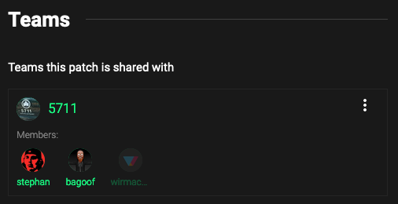

# Patches

Patches on [cables.gl](https://cables.gl) cables.gl can be private or public, pick one of the two for the level of permission
and collaboration you deem appropriate. We strongly encourage making your patch public to share your work with the community!

---

## Public patches

You can share patches with the whole community by making them public in the settings of the patch. There is a few restrictions on which
patches can be published, depending on which [ops](../3_ops/ops) are used in the patch.

Public patches can be:

- Viewed by everyone in the community and even [visitors](../0_users/users)
- Opened in the editor, altered but not saved by [visitors](../0_users/users) and any user
- Cloned for remixing, basis for new work or inspiration by any registered user
- Voted on by any registered user to appear in the "Top Patches"
- We sometimes pick social media posts from the "Top Patches" to publish on the cables accounts, you will be properly credited

---

## Private patches

Once you create or clone a patch on [cables.gl](https://cables.gl) it is marked as private. This means:

- Only you (as the owner) can view the patch on the patchpage
- Only you (as the owner) can view, edit and save the patch in the editor
- Only you (as the owner) can invite other people for collaboration or add the patch to a [team](../2_teams/teams)
- Only the owner can delete a patch and all it's assets

### Secret URL

Cables allows you to create a secret url for any private patch. This URL can then be shared with people that are not collaborators to the patch or have no account on [cables.gl](https://cables.gl). 

With this URL users can:

- View the patch on the patchpage (like [this](/p/RnUxjX))
- NOT open it in the editor

---

## Shared patches

There are several ways to share patches on [cables.gl](https://cables.gl). Depending on your usecase or audience, pick any of the following:

### Collaborators

By adding other users to your patch, you grant them "read only" or "full access" to your patch. Use this to work on patches with other people.

Users with "Read Only" access can:

- View the patch on the patch page
- "Request Write Access" to the patch
- Open the patch in the editor, alter it but not save it
- Clone the patch for remixing or continue to work on it (and decide on who to keep as collaborators in the cloned patch)
- See and use all the [custom ops](../3_ops/ops) of collaborators
- See and use all the [custom ops](../3_ops/ops) of teams that are used in the patch
- join [multiplayer sessions](../4_multiplayer) to work on patches with other users

Users with "Full Access" can do all of the above, and:

- Edit the patch and save it
- Upload files to use as assets in the patch
- Create [patch-ops](../3_ops/ops) to use in the patch
- Add [ops](../3_ops/ops) of their teams to the patch
- Manage patch settings (change name, pick licence, publish the patch, ...)
- Invite other users or add teams as collaborators
- Delegate ownership of a patch to some other collaborator

### Teams

Using the "Collaboration" tab in the patch settings you can add one or multiple [teams](../2_teams/teams) to the patch (if you have "Full Access").

Adding a team to any patch will:

- Show the patch on the [teams](../2_teams/teams) page
- Grant "Read Only" access to all (current and future) team members
- "Full Access" still needs to be granted on a personal level, via collaborators (see above)
