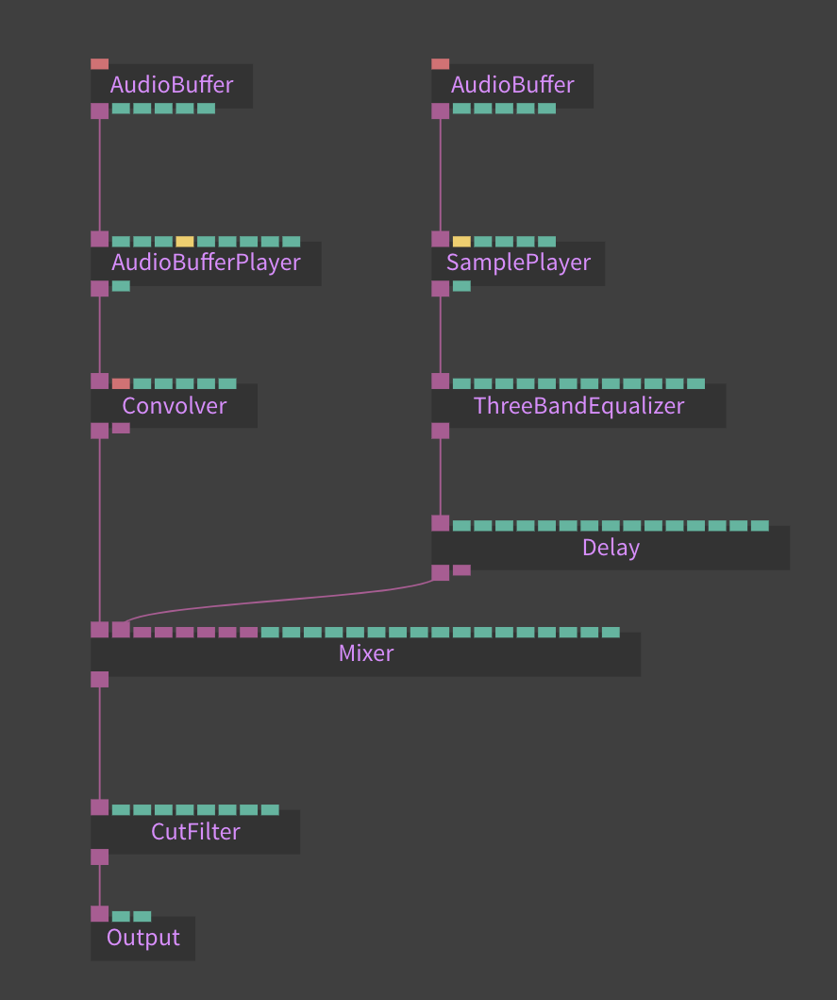

# Working with Effects

Now that we have a basic input-output chain going and hear sound being played, it is time to add effects. Cables offers a multitude of WebAudio effects. To add an effect to your audio, simply put one of the audio effect operators between your player and the output.

## Audio effects in cables

### Gain and Panning

You can raise and lower the volume of a sound by adding a [Gain](https://cables.gl/op/Ops.WebAudio.Gain) op.

If you want to pan your signal (moving it left or right in the stereo space), have a look at the [AudioPanner](https://cables.gl/op/Ops.WebAudio.AudioPanner) op. Check its [example patch](https://cables.gl/edit/5f7c7953babf3079c124974a) to see how you can automate left-to-right movement.

### Filters

If you want to filter your signal, attenuate or exagerate certain frequencies, there are multiple ops at your disposal. For simple equalizing tasks, the [ThreeBandEqualizer](https://cables.gl/op/Ops.WebAudio.ThreeBandEqualizer) op is recommended. It features three bands with different filter types. Have a look at the [example](https://cables.gl/edit/5fd7862f7c7e326dfef723e5) for a more detailed explanation.

In addition to the ThreeBandEqualizer, we have a more "DJ-Style" filter operator, the [CutFilter](https://cables.gl/op/Ops.WebAudio.CutFilter) op. It features a low- and a highpass filter with different slope characteristics, similiar to a DJ mixer. Have a look at the [example patch](https://cables.gl/edit/5fd78ab37c7e326dfef723ee).

The last filter is the [BiquadFilter](https://cables.gl/op/Ops.WebAudio.BiquadFilter_v2). This filter is a single filter that features all availible filter types in the [WebAudio standard](https://developer.mozilla.org/en-US/docs/Web/API/BiquadFilterNode/type). If you are looking for more advanced filters, then this is the op to go. Have a look at it's [example patch](https://cables.gl/edit/5fd8b8de1d3e0022a8736fef).

**IMPORTANT NOTE ON FILTER Q VALUES!!!: WATCH OUT FOR HIGH Q VALUES, THEY CAN CREATE LOUD AND UNPLEASANT FEEDBACK. ESPECIALLY WHEN WORKING WITH HEADPHONES ON LOUD VOLUMES THERE IS A POTENTIAL FOR EAR DAMAGE!!**

### Reverb & Delay

If you want to add a reverb to your sound and you are familiar with [Convolution Reverb](https://en.wikipedia.org/wiki/Convolution_reverb), you can use the [Convolver op](https://cables.gl/op/Ops.WebAudio.Convolver_v2). Have a look at the [example patch](https://cables.gl/edit/5fd732eed2245c43bad1b762) for more details. Cables also offers a [Delay op](https://cables.gl/op/Ops.WebAudio.Delay) you can use to add delay to an audio stream.

Here is an example of how a more complex effect chain could look like:

