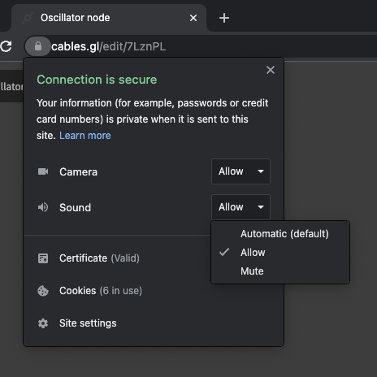

# Audio in web browsers

Before diving into adding sounds into your cables projects, let's cover some basics of web based audio in its current state.
As a general rule, browsers will only allow playing audio after some user-interaction with the webpage has happened.
This is to make websites less intrusive and annoying when you open them in a desktop or mobile browser. It is also part of security permissions set for a website - in our case: 

- cables.gl published patch pages
- the cables.gl editor
- your own website where you plan to export your project to

We recommend checking out the standards for web browsers and devices you plan to deploy on and definitely advise some debugging time to nail all of the gotchas.

Some reference materials:

https://developer.chrome.com/blog/autoplay/

https://developer.mozilla.org/en-US/docs/Web/Media/Autoplay_guide

 
let's take a look at some frequently asked questions and answers:

### why does my sound work in cables.gl editor but not when I export the project to my server?

This is most likely related to the way web browsers decide if a sound is allowed to play on a webpage. When you are working in the cables.gl editor, you are interacting with a "website" and therefore any audio that you specify to play will be allowed to play. 

When you or a visitor to your page sees the same project, you may not have set up a user interaction to allow the browser to play a sound. The easiest way to insure that you can play sounds in your exported and shared projects is to add a [PlayButton operator](https://cables.gl/op/Ops.Patch.PlayButton).

### we still don't get sound in my project, but everything seems to be setup correctly?
The second most common reason why a sound won't play on a webpage is that the browser tab is muted.
To unmute a browser tab click on the speaker button in a browser tab.

Another, less common, reason is that the user has explicitly blocked permission for the website to play audio.
A website will ask permission for webcam, microphone and even audio access. If a user has blocked audio playback access on your webpage, they will not be able to hear sounds that are played.
Most often this won't be an issue, but just in case, this is how you can test if sound is blocked on a page or a browser tab:

in Chrome you can click the little Lock icon next to the url.
(if you don't see sound settings, click "site settings")
- "allow" will always allow playing audio automatically
- "default" will (probably) suspend it by default
- "block" will always block a permission

 

### what is this speaker button on my patch? 

The [AudioOutput operator](https://cables.gl/op/Ops.WebAudio.Output_v2) has been streamlined and now displays a button to manually permit the browser to play your project's audio. Think of it as a free PlayButton safety net in case you don't need or forgot to add it into your patch.

In case you don't want to see the little speaker button, you can toggle it off in the op's parameters.

